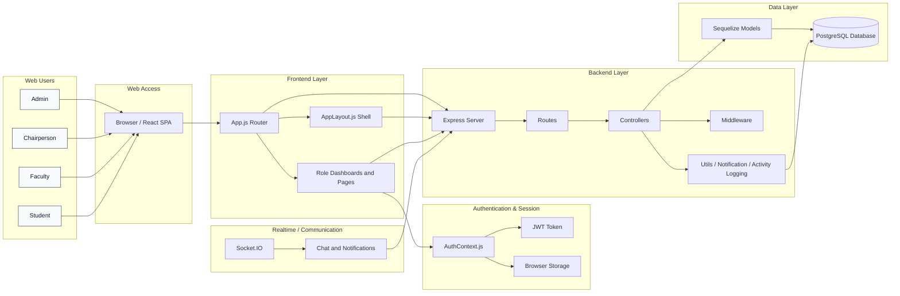

# AGMS System Architecture

## Architecture Summary

The AGMS project uses a role-based full-stack web architecture:

- Users access the system through a single React web application.
- The React frontend renders dashboards and pages based on the logged-in role.
- Auth state is stored in the browser and backed by JWT authentication.
- Backend Express routes process API requests through the controller and model layers.
- Sequelize models map to PostgreSQL data tables for users, subjects, classes, grades, enrollments, endorsements, notifications, chat, and activity logs.
- Socket.IO supports realtime chat and notification communication.
- Activity logging and notifications provide audit and communication services across the system.
